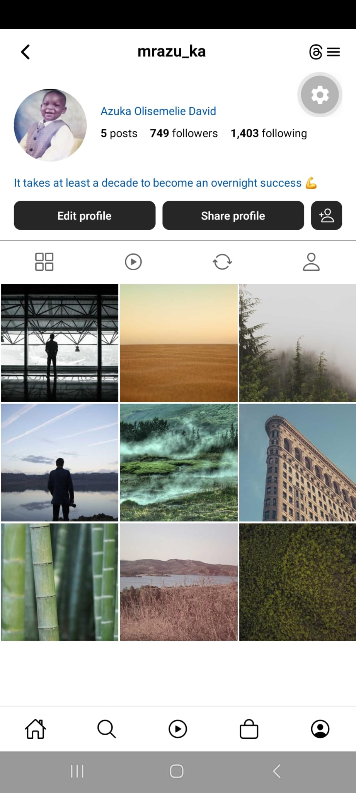

# Instagram Profile Clone (Expo)

A React Native + Expo Router recreation of an Instagram profile screen.

## Run it

```bash
npm install
npx expo start
```

Scan the QR code with Expo Go, or press `i` / `a` / `w` to open an
iOS/Android simulator or web.

## Project structure

```
src/app/
├── _layout.tsx        # Root layout — Stack navigator config
├── index.tsx           # Main profile screen
├── header.tsx            # Top bar (username, icons)
├── profilestate.tsx       # Avatar, name, stats, bio
├── profiletab.tsx       # Tabs bar
├── bottomtab.tsx            # Bottom navigation bar
├── buttons.tsx       # Action buttons
├── photogrid.tsx              # 3-column post grid
└── styles.tsx                  # Shared styles
```

## Screenshot of Template


## Screenshot of Work Done


